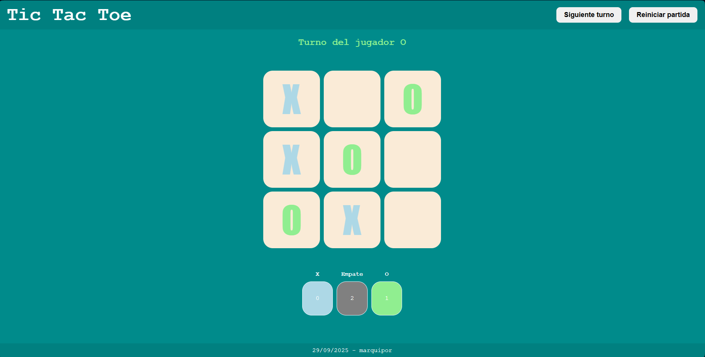

# Tic Tac Toe

A simple complete Tic Tac Toe game for two players, built with HTML, CSS and JavaScript.  
It includes a scoreboard and buttons to start a round or reset the game with full score history.  



## Features
- Two-player mode (X and O).  
- Dynamic message showing the active player.  
- Automatically detects the winner or declares a draw.  
- Real-time scoreboard with counters for wins and draws.  
- Control buttons:  
  - "Siguiente turno": Clears the board but keeps the score.  
  - "Reiniciar partida": Reset board and scoreboard.  

## Technologies

- HTML5  
- CSS3  
- JavaScript  

## Project structure

tic-tac-toe/  
│  
├── index.html              # Main page  
├── css/  
│   └── style_tictactoe.css # Game styles  
└── js/  
    └── tictactoe.js        # Game logic  

## How to Run
1. Clone this repository:
  ````
git clone https://github.com/marquipor/tic-tac-toe.git

  ````
2. Open index.html in your browser.
3. Play!
